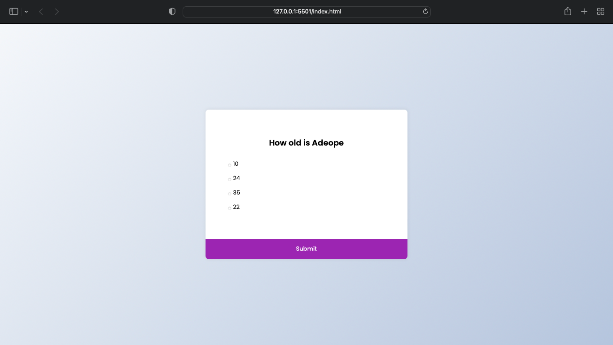

# QUIZ App

This is a QUIZ App with 5 simple question using vanilla JS

## Table of contents

- [Screenshot](#screenshot)
- [Links](#links)
- [Built with](#built-with)
- [What I learned](#what-i-learned)
- [Author](#author)
- [Acknowledgments](#acknowledgments)

**Note: Delete this note and update the table of contents based on what sections you keep.**


### Screenshot



### Built with

- Semantic HTML5 markup
- CSS custom properties
- Flexbox
-Vanilla JS


### What I learned

I learnt the use of EventListener using the .addeventListener('click',()=>{and the function in here})

To see how you can add code snippets, see below:
This is how I use radio button to get answers from users
```html
            <li>
            <input type="radio" id="a" name="answer" class="answer"/>
            <label id="a_text" for="a">Question</label>
          </li>
```
```js
    submitBtn.addEventListener("click", () => {
  const answer = getSelected();

  if (answer) {
    if (answer === quizData[currentQuiz].correct) {
      score++;
    }
    currentQuiz++;
    if (currentQuiz < quizData.length) {
      loadQuiz();
    } else {
      quiz.innerHTML = `<h2>You answered correctly ${score} out of ${quizData.length} question</h2><button onclick="location.reload()">Reload Quiz</button>`;
    }
  }
});


```


## Author

- Website - [Adefila Mustapha](https://www.adeope.org)
- Twitter - [@adeope63](https://www.twitter.com/adeope63)


## Acknowledgments

I want to say a big thank you to Florin Pop for giving me this opportunity to prove myself and improve my skills in JS and CSS with this task.
